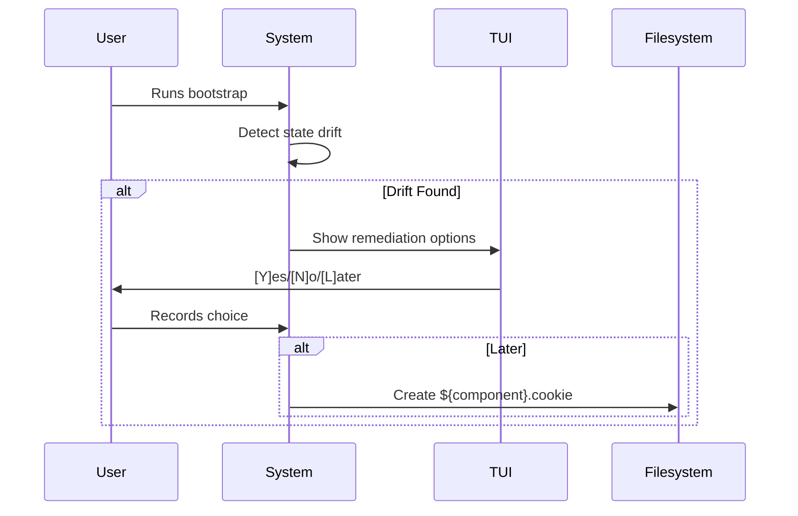

# Spec 7 — TUI Remediation System

## Goal
Interactive terminal interface for state remediation with yes/no/later choices.

## Components
1. **TUI Engine** (`helpers/tui.sh`)
   - Uses `dialog` or `whiptail`
   - Consistent color scheme (yellow warnings, red errors)
2. **Cookie System**
   - Persistent note files in `/opt/ai-configuration/remediation_cookies/`
   - No expiration; manual cleanup required

## Workflow

## Requirements
- Cookie filenames match component names (e.g., `vllm.cookie`)
- Log all interactions to `/opt/ai-configuration/logs/tui.log`
